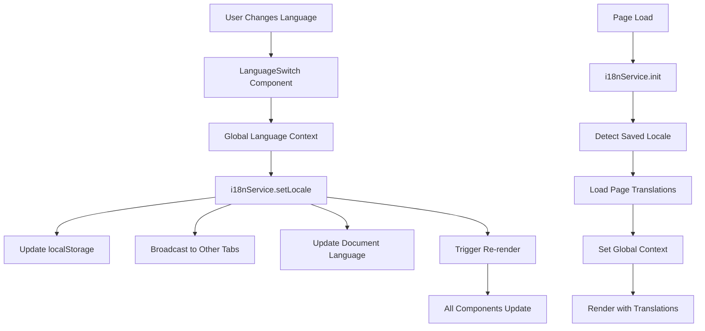

# Design Document

## Overview

The Language Sync System creates a unified internationalization (i18n) architecture that synchronizes language preferences across all pages in the UdaanSarathi application. The system leverages the existing i18nService and LanguageSwitch components while extending functionality to ensure consistent language state management and comprehensive JSON-based translations.

## Architecture

### Core Components

1. **Enhanced i18nService**: Central service managing translations, locale state, and cross-tab synchronization
2. **Global Language Context**: React context providing language state to all components
3. **Enhanced LanguageSwitch**: Improved component with global state synchronization
4. **Translation Management System**: Organized JSON structure for all page and component translations
5. **Language Persistence Layer**: localStorage-based persistence with cross-tab synchronization

### System Flow



## Components and Interfaces

### 1. Global Language Context

**Purpose**: Provide language state and translation functions to all components

**Interface**:
```javascript
interface LanguageContextValue {
  locale: string
  setLocale: (locale: string) => Promise<void>
  t: (key: string, params?: object) => string
  tPage: (pageName: string, key: string, params?: object) => string
  isLoading: boolean
  availableLocales: string[]
  getLocaleDisplayName: (locale: string) => string
}
```

**Implementation Strategy**:
- Create React Context with LanguageProvider
- Wrap entire application with provider
- Use useLanguage hook for component access
- Handle loading states during locale changes

### 2. Enhanced i18nService

**Current State**: Service exists with basic functionality
**Enhancements Needed**:

- Cross-tab synchronization using storage events
- Automatic page translation loading
- Enhanced caching for better performance
- Missing translation tracking and fallbacks

**New Methods**:
```javascript
// Cross-tab synchronization
syncAcrossTabs()
handleStorageChange(event)

// Automatic translation loading
autoLoadPageTranslations(pageName)
preloadCriticalTranslations()

// Enhanced state management
subscribeToLocaleChanges(callback)
unsubscribeFromLocaleChanges(callback)
```

### 3. Enhanced LanguageSwitch Component

**Current State**: Component exists with dropdown functionality
**Enhancements Needed**:

- Integration with global context
- Loading states during language changes
- Accessibility improvements
- Consistent styling across pages

**Props Interface**:
```javascript
interface LanguageSwitchProps {
  variant?: 'default' | 'primary' | 'ghost' | 'minimal'
  size?: 'sm' | 'md' | 'lg'
  className?: string
  showLabel?: boolean
  position?: 'bottom-left' | 'bottom-right' | 'top-left' | 'top-right'
  onLanguageChange?: (locale: string) => void
}
```

### 4. Translation File Structure

**Organization Strategy**:
```
src/translations/
├── en/
│   ├── common.json          # Shared translations
│   ├── pages/
│   │   ├── login.json
│   │   ├── register.json
│   │   ├── dashboard.json
│   │   ├── jobs.json
│   │   ├── applications.json
│   │   ├── interviews.json
│   │   ├── workflow.json
│   │   ├── drafts.json
│   │   ├── team-members.json
│   │   ├── audit-log.json
│   │   └── agency-settings.json
│   └── components/
│       ├── navigation.json
│       ├── forms.json
│       └── modals.json
└── ne/
    └── [same structure as en/]
```

**Translation Key Conventions**:
- Page-specific: `pageName.sectionName.elementName`
- Common elements: `common.elementType.elementName`
- Form elements: `forms.fieldType.fieldName`
- Navigation: `navigation.menuItem`

## Data Models

### 1. Translation Schema

```javascript
// Page Translation File Schema
{
  "meta": {
    "version": "1.0.0",
    "lastUpdated": "2024-09-25",
    "completeness": 100
  },
  "title": "Page Title",
  "sections": {
    "header": {
      "title": "Section Title",
      "subtitle": "Section Subtitle"
    },
    "tabs": {
      "overview": "Overview",
      "details": "Details",
      "settings": "Settings"
    },
    "buttons": {
      "save": "Save",
      "cancel": "Cancel",
      "delete": "Delete"
    },
    "forms": {
      "labels": {
        "name": "Name",
        "email": "Email"
      },
      "placeholders": {
        "enterName": "Enter your name",
        "enterEmail": "Enter your email"
      },
      "validation": {
        "required": "This field is required",
        "invalidEmail": "Please enter a valid email"
      }
    }
  }
}
```

### 2. Language Preference Model

```javascript
// Stored in localStorage
{
  "preferredLocale": "en",
  "timestamp": 1695648000000,
  "version": "1.0.0"
}
```

### 3. Translation Loading State

```javascript
// Component state for loading management
{
  "isLoading": false,
  "loadingPages": [],
  "error": null,
  "lastUpdated": 1695648000000
}
```

## Error Handling

### 1. Translation Loading Errors

**Strategy**: Graceful degradation with fallbacks
- Primary: Load requested locale translation
- Fallback 1: Load English translation
- Fallback 2: Display translation key
- Fallback 3: Display generic error message

**Implementation**:
```javascript
async loadTranslationWithFallback(locale, pageName) {
  try {
    return await this.loadPageTranslations(pageName, locale)
  } catch (error) {
    console.warn(`Failed to load ${locale} translations for ${pageName}`)
    if (locale !== 'en') {
      return await this.loadPageTranslations(pageName, 'en')
    }
    return this.getEmergencyTranslations(pageName)
  }
}
```

### 2. Cross-Tab Synchronization Errors

**Strategy**: Isolated failure handling
- Log synchronization failures
- Continue with local state
- Retry synchronization on next change

### 3. Storage Errors

**Strategy**: Progressive enhancement
- Primary: localStorage
- Fallback: sessionStorage
- Final fallback: in-memory state

## Testing Strategy

### 1. Unit Tests

**Translation Service Tests**:
- Locale switching functionality
- Translation key resolution
- Fallback mechanisms
- Cache management
- Cross-tab synchronization

**Component Tests**:
- LanguageSwitch interaction
- Context provider functionality
- Hook behavior
- Loading states

### 2. Integration Tests

**Page Translation Tests**:
- Complete page translation loading
- Language switching across pages
- Persistence across sessions
- Cross-tab synchronization

**User Journey Tests**:
- Login → Dashboard language consistency
- Navigation with language persistence
- Form submission with translated validation

### 3. Performance Tests

**Translation Loading**:
- Initial page load performance
- Language switching speed
- Cache effectiveness
- Memory usage optimization

### 4. Accessibility Tests

**Language Su ort**:
- Screen reader compatibility
- Keyboard navigation
- Language attribute updates
- RTL support (future consideration)

## Implementation Phases

### Phase 1: Core Infrastructure
- Enhance i18nService with cross-tab sync
- Create global language context
- Implement enhanced LanguageSwitch

### Phase 2: Page Translation Migration
- Create translation files for all pages
- Replace hardcoded text with translation keys
- Implement page-specific translation loading

### Phase 3: Component Translation System
- Create component-specific translations
- Implement component translation hooks
- Add translation validation

### Phase 4: Optimization and Polish
- Implement translation preloading
- Add performance monitoring
- Enhance error handling
- Add development tools

## Security Considerations

### 1. Translation File Security
- Validate translation file structure
- Sanitize interpolated values
- Prevent XSS through translations

### 2. Storage Security
- Validate stored locale values
- Handle corrupted localStorage gracefully
- Implement storage quota management

## Performance Optimizations

### 1. Translation Loading
- Lazy load page-specific translations
- Preload critical translations
- Implement intelligent caching
- Use compression for large translation files

### 2. Re-rendering Optimization
- Memoize translation functions
- Optimize context updates
- Implement selective re-rendering
- Use React.memo for translation components

### 3. Memory Management
- Clear unused translation cache
- Implement cache size limits
- Monitor memory usage
- Garbage collect old translations

## Monitoring and Analytics

### 1. Translation Usage Tracking
- Track missing translations
- Monitor translation loading performance
- Analyze language preference patterns
- Measure user engagement by language

### 2. Error Monitoring
- Track translation loading failures
- Monitor cross-tab sync issues
- Alert on critical translation errors
- Performance regression detection

## Future Enhancements

### 1. Advanced Features
- Pluralization support
- Date/time localization
- Number formatting
- Currency localization

### 2. Developer Experience
- Translation management UI
- Automated translation validation
- Missing translation detection
- Translation coverage reports

### 3. User Experience
- Language auto-detection
- Regional locale support
- Contextual translations
- Translation quality feedback